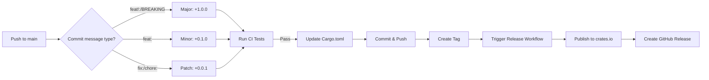

# 🚀 ZFish Automatic Release System

This repository uses an **automatic semantic versioning and release system** that publishes to crates.io based on your commit messages.

---

## 📋 How It Works

Every push to the `main` branch triggers an automatic version bump and release based on your commit message:

### 🔴 Major Version Bump (`+1.0.0`) - Breaking Changes

Triggered by commit messages starting with:
- `BREAKING CHANGE:`
- `breaking:`
- `major:`
- `feat!:`
- `fix!:`

**Examples:**
```bash
git commit -m "feat!: redesign API to use builder pattern"
git commit -m "BREAKING CHANGE: remove deprecated Terminal::new_raw() method"
git commit -m "major: change ProgressBar to use async interface"
```

**Result:** `0.1.0` → `1.0.0`

---

### 🟡 Minor Version Bump (`+0.1.0`) - New Features

Triggered by commit messages starting with:
- `feat:`
- `feature:`
- `minor:`

**Examples:**
```bash
git commit -m "feat: add table formatting support"
git commit -m "feature: implement new spinner styles"
git commit -m "minor: add Windows terminal color support"
```

**Result:** `0.1.0` → `0.2.0`

---

### 🟢 Patch Version Bump (`+0.0.1`) - Bug Fixes & Maintenance

Triggered by commit messages starting with:
- `fix:`
- `patch:`
- `chore:`
- `docs:`
- `style:`
- `refactor:`
- `perf:`
- `test:`
- `build:`
- `ci:`

**Examples:**
```bash
git commit -m "fix: correct terminal size detection on macOS"
git commit -m "docs: update README with new examples"
git commit -m "chore: update dependencies"
git commit -m "perf: optimize progress bar rendering"
```

**Result:** `0.1.0` → `0.1.1`

---

## 🔄 Complete Workflow



### What Happens Automatically:

1. **CI Tests Run** - All tests, clippy, formatting checks
2. **Version Calculated** - Based on your commit message
3. **Check crates.io** - Ensures version doesn't already exist
4. **Cargo.toml Updated** - New version written
5. **Lock File Updated** - `cargo update` runs
6. **Final Tests** - One more test run before release
7. **Git Commit** - Version bump committed with `[skip ci]`
8. **Git Tag Created** - New version tag (e.g., `v0.2.0`)
9. **Tag Pushed** - Triggers the Release workflow
10. **Publish to crates.io** - If version is new
11. **GitHub Release Created** - With changelog link

---

## 🎯 Best Practices

### ✅ DO:

```bash
# Use conventional commit prefixes
git commit -m "feat: add color theme support"
git commit -m "fix: resolve panic on empty input"
git commit -m "docs: add examples for progress bars"

# Be descriptive
git commit -m "feat: implement spinner animation with 8 styles"

# Use breaking change notation for API changes
git commit -m "feat!: change ProgressBar::new to require total parameter"
```

### ❌ DON'T:

```bash
# Vague messages (will still work, defaults to patch)
git commit -m "updates"
git commit -m "changes"

# Skip meaningful commits
git commit -m "wip"
```

---

## 🛑 Preventing Automatic Releases

If you want to push changes **without triggering a release**, add `[skip ci]` or `[no release]` to your commit message:

```bash
git commit -m "docs: update readme [skip ci]"
git commit -m "test: add more unit tests [no release]"
```

---

## 🎮 Manual Release Control

You can manually trigger a release from GitHub Actions:

1. Go to **Actions** tab
2. Select **Auto Version Bump & Release**
3. Click **Run workflow**
4. Choose version bump type:
   - `patch` - Bug fixes (+0.0.1)
   - `minor` - New features (+0.1.0)
   - `major` - Breaking changes (+1.0.0)

---

## 📊 Current Workflows

### 1. **CI Workflow** (`.github/workflows/ci.yml`)
- Runs on every push and PR
- Tests on Linux, Windows, macOS
- Runs clippy, formatting checks, documentation
- Tests on stable Rust and MSRV (1.90.0)

### 2. **Auto Release Workflow** (`.github/workflows/auto-release.yml`)
- Runs on push to `main` (unless `[skip ci]`)
- Analyzes commit message
- Bumps version semantically
- Creates tag
- Triggers Release workflow

### 3. **Release Workflow** (`.github/workflows/release.yml`)
- Runs when a tag like `v*.*.*` is pushed
- Verifies version matches tag
- Checks if already published
- Publishes to crates.io (if needed)
- Creates GitHub release

---

## 🔧 Configuration

### Required GitHub Secrets

Add this secret to your repository:

| Secret Name    | Description                          | Get it from                         |
| -------------- | ------------------------------------ | ----------------------------------- |
| `CARGO_TOKEN`  | crates.io API token for publishing   | https://crates.io/settings/tokens   |

**To add:**
1. Go to `Settings` → `Secrets and variables` → `Actions`
2. Click `New repository secret`
3. Name: `CARGO_TOKEN`
4. Value: Your crates.io token
5. Click `Add secret`

---

## 📈 Version History Examples

Starting version: `0.1.0`

| Commit Message                                      | New Version | Reasoning           |
| --------------------------------------------------- | ----------- | ------------------- |
| `fix: correct terminal size on Windows`             | `0.1.1`     | Bug fix → patch     |
| `feat: add table rendering support`                 | `0.2.0`     | New feature → minor |
| `chore: update documentation`                       | `0.2.1`     | Maintenance → patch |
| `feat: implement color themes`                      | `0.3.0`     | New feature → minor |
| `feat!: redesign API with builder pattern`          | `1.0.0`     | Breaking → major    |

---

## 🐛 Troubleshooting

### "crate already exists on crates.io"
- The workflow automatically checks for this
- It will skip publishing if version exists
- Just push another commit with a different change type

### Version didn't bump
- Check if commit message had `[skip ci]` or `[no release]`
- Verify commit message uses conventional format
- Check GitHub Actions logs for details

### Tests failed during auto-release
- Fix the failing tests
- Push the fix with `fix:` prefix
- Auto-release will run again

---

## 📚 Resources

- [Conventional Commits Specification](https://www.conventionalcommits.org/)
- [Semantic Versioning 2.0.0](https://semver.org/)
- [Cargo Publishing Guide](https://doc.rust-lang.org/cargo/reference/publishing.html)

---

## 🎉 Example Workflow

```bash
# 1. Make changes
vim src/progress.rs

# 2. Add new feature
git add src/progress.rs

# 3. Commit with conventional prefix
git commit -m "feat: add rainbow color mode for progress bars"

# 4. Push to main
git push origin main

# ✨ Automatic from here:
# - CI runs tests
# - Version bumps: 0.1.0 → 0.2.0
# - Cargo.toml updated
# - Tag v0.2.0 created
# - Published to crates.io
# - GitHub release created
```

---

**That's it! Your releases are now fully automated.** 🚀

Just write good commit messages and let GitHub Actions handle the rest!
